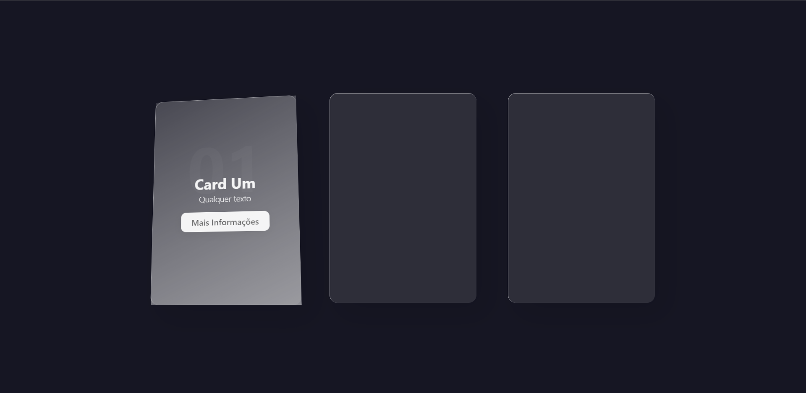

# Projeto de Cards Animados

# 🛠️ Tecnologias utilizadas

 
    
  
  
  
  
  

 

# 👨‍🎓 O que aprendi

- Pude usar mais o CSS3 para estilizar e animar algumas coisas do projeto
- Busquei a biblioteca do java na internet para aminar melhor o projeto

# 📧 Contato

<a href = "mailto:probertos717@gmail.com">